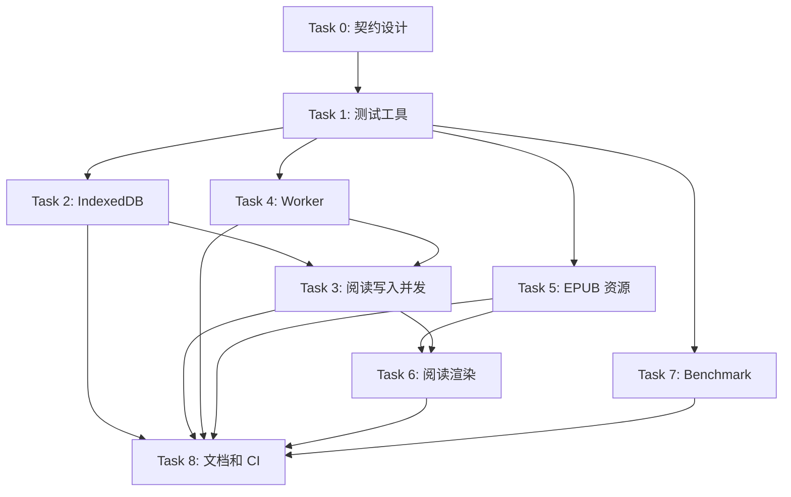

# 阅读器可靠性与测试补全实施计划

> **For agentic workers:** REQUIRED SUB-SKILL: Use superpowers:subagent-driven-development (recommended) or superpowers:executing-plans to implement this plan task-by-task. Steps use checkbox (`- [ ]`) syntax for tracking.

**Goal:** 补齐 IndexedDB、Worker、EPUB 资源和阅读渲染的自动化测试，并修复已确认的并发、错误恢复和数据一致性风险。

**Architecture:** 保持当前原生 ES Module、Tauri 和直接 DOM 架构，不做一次性框架迁移。把难以测试的副作用拆成小型纯函数或可注入适配器，再用 Node 测试覆盖数据层和 Worker 生命周期，用轻量 DOM 测试覆盖阅读渲染关键路径。

**Tech Stack:** Node.js `node:test`、`fake-indexeddb`、Node `perf_hooks`、现有 Tauri/Rust 测试；如 DOM 测试确实需要浏览器环境，再增加轻量 DOM 测试依赖，不使用 Codex 内置浏览器验证本地项目。

## Global Constraints

- 保留原生 ES Module，不引入 React/Vue，也不进行全量 TypeScript 重写。
- 所有行为修复先写失败测试，再修改生产代码。
- IndexedDB 的事务语义以“提交完成才成功”为准，abort/error 必须向调用方传播。
- 不改变已有书籍数据格式；如必须升级 IndexedDB schema，增加迁移测试和回滚说明。
- 不把人工回归测试误称为自动化测试；每项覆盖都要有可重复的命令。
- 不使用 Codex 内置浏览器访问、启动或验证本地项目。

## 通用退出条件

每个 Task 都先用测试验证其风险假设。若测试证明当前实现已满足目标或问题不成立，则停止扩大改动范围：只补充测试、注释和文档，不引入不必要的生产代码重构。

---

### Task 0: 明确副作用和错误处理契约

**Files:**
- Create: `docs/superpowers/specs/2026-08-04-reader-reliability-contracts.md`
- Modify: `docs/superpowers/plans/2026-08-04-reader-reliability-tests.md`

**目标:** 在改动数据写入和 Worker 前，统一异步副作用的接口、隔离范围和错误语义。

- [x] 明确 `KeyedWriteQueue` 契约：按书籍 ID 或配置 key 隔离；同 key 串行、不同 key 并行；前一次失败不阻塞后续任务；防抖留在调用层而不是队列内部。
- [x] 明确 Worker runner 契约：接受 `url`、`message`、`fallback`、`timeoutMs` 和可选 Worker 工厂；返回单次 settle 的 Promise。
- [x] 明确错误策略：持久化失败向调用方 reject；可降级的读取、Worker 和 EPUB 资源失败记录 warning 后返回 fallback；不得静默吞掉影响数据完整性的错误。
- [x] 列出 queue、adapter 和业务调用层各自的职责，避免 Task 3 与 Task 4 形成两套不兼容的错误处理方式。

验收标准：契约文档描述参数、返回值、失败语义和调用方职责；后续 Task 的测试名称和实现都以该契约为准。

退出条件：无。该 Task 是后续并行工作的设计前置。

---

### Task 1: 建立测试边界和测试工具

**Files:**
- Modify: `package.json`
- Modify: `scripts/test-all.mjs`
- Create: `scripts/test-test-helpers.mjs`
- Create: `scripts/test-fixtures.mjs`
- Modify: `docs/testing.md`

**目标:** 统一测试入口，提供 fake IndexedDB、可控 Worker、可控时钟和资源 URL 的测试夹具。

- [x] 统计当前测试文件和核心模块覆盖边界，避免重复造测试夹具。
- [x] 为 IndexedDB 测试建立独立数据库名和清理流程，保证测试之间互不污染。
- [x] 为 Worker 测试提供可注入的 Worker 工厂，能模拟完成、报错、无响应三种状态。
- [x] 为 EPUB 测试提供可控的 JSZip、`URL.createObjectURL` 和 `URL.revokeObjectURL` 替身。
- [x] 保留 `scripts/test-all.mjs` 的自动发现机制，并在 `CONTRIBUTING.md` 规定测试必须命名为 `test-*.mjs` 或 `test-*.cjs`；不引入需要手工维护的 `test-manifest.json`。
- [x] 增加元测试或脚本检查，防止测试文件因命名不符合约定而被无意跳过。
- [x] 运行 `npm test`，确认新夹具本身不会改变现有测试结果。

验收标准：现有 Node 测试全部通过；后续测试可以在不启动 Tauri 和浏览器的情况下运行。

退出条件：若现有 `fake-indexeddb` 和测试工具已足够覆盖目标场景，则不新增通用夹具文件，只在对应测试中保留最小辅助代码。

### Task 2: 覆盖 IndexedDB 事务失败与数据一致性

**Files:**
- Modify: `app_unpacked/src/js/data/storage.js`
- Modify: `app_unpacked/src/js/data/storage-chunks.js`
- Create: `scripts/test-storage-transactions.mjs`
- Modify: `scripts/test-storage-chunks.mjs`

**目标:** 证明事务只有在 `complete` 后才成功，验证 request error、transaction error、abort 和 action 抛错路径。

**影响范围:** `storage.js` 的 `runTransaction()` 被所有 IndexedDB 读写入口使用；`writeContent()` 同时影响导入、编辑保存、迁移恢复和大文本分块。任何事务语义变化都必须回归 `file.js`、`storage-chunks.js` 和迁移测试。

- [x] 先写测试：request 成功后事务 abort 时，调用方必须 reject。
- [x] 先写测试：`transaction.onerror` 和 `transaction.onabort` 都能返回可识别的 Error。
- [x] 先写测试：事务 action 同步抛错时会终止事务并 reject。
- [x] 先写测试：大文本更新失败时，旧内容仍可读；不要先假定必须重写存储算法。
- [x] 如果 fake IndexedDB 证明当前同一事务具备原子回滚，保留现有写入结构并补注释；只有测试证明存在跨事务风险时才引入版本化写入。
- [x] 对 `writeContent` 的小文本、大文本、空内容和旧 chunk 清理分别添加测试。

验收标准：所有事务失败测试稳定复现；中途失败不会返回假成功，也不会留下可观察的半成品数据。

退出条件：若 fake IndexedDB 测试证明当前单一事务可原子回滚，保留 `writeContent()` 的现有事务结构，只补充事务语义注释和测试；仅在证明存在跨事务半成品时设计版本化写入。

### Task 3: 修复阅读索引和元数据并发写入

**Files:**
- Modify: `app_unpacked/src/js/page/read/index/readindex.js`
- Modify: `app_unpacked/src/js/page/read/readpage.js`
- Modify: `app_unpacked/src/js/data/file.js`
- Modify: `app_unpacked/src/js/data/keyed-queue.js`
- Create: `scripts/test-reading-save-queues.mjs`

**目标:** 让同一本书的 index、metadata 和 content 写入遵循统一的串行策略，并保留最新状态。

**影响范围:** 执行前用 `rg` 列出 `writeIndex()`、`file.setIndex()`、`file.setMeta()` 和 `queueMetaSave()` 的全部调用点。重点检查目录更新、书签增删、阅读 cursor 防抖保存、编辑保存和迁移恢复，避免按当前文件名假定调用链不变。

- [ ] 先写测试：连续调用 `writeIndex()` 时只保留最后一次状态，不能让旧快照覆盖新快照。
- [ ] 先写测试：连续调用 `queueMetaSave()` 时按顺序执行，错误不会破坏后续队列。
- [ ] 先写测试：编辑保存失败后，下一次保存仍会重试，但成功后不重复保存相同内容。
- [ ] 将 `file.setIndex`、`file.setMeta` 和必要的编辑保存统一接入按书籍 ID 的队列，避免只保护 `updateBook()` 而遗漏单字段写入。
- [ ] 对高频 cursor 更新保留现有 350ms 防抖，队列只负责提交顺序，不把所有阅读操作串成一个全局队列。

验收标准：高频目录、书签、阅读进度和编辑保存不会出现旧值覆盖新值；不同书籍之间仍可并行保存。

退出条件：若队列测试证明现有调用链已经严格串行且最终状态正确，则仅为未受保护的 `file.setIndex()` / `file.setMeta()` 调用补队列或等待，不重构其他阅读流程。

### Task 4: 抽取并测试 Worker 超时逻辑

**Files:**
- Modify: `app_unpacked/src/js/text/text.js`
- Create: `app_unpacked/src/js/text/worker-runner.js`
- Create: `scripts/test-worker-runner.mjs`

**目标:** 把 Worker 生命周期从文本转换业务中抽出，直接测试完成、错误、缺少 Worker、超时和重复消息。

**影响范围:** 执行前确认 `runWorker()` 的所有调用点。当前至少包含中文转换和目录识别，两者的 fallback 不同：中文转换返回原文，目录识别不生成目录；runner 必须保留调用方自定义 fallback 的能力。

- [x] 先写测试：Worker 返回结果时 resolve 正确值并 terminate。
- [x] 先写测试：Worker 抛错时返回 fallback 并 terminate。
- [x] 先写测试：Worker 不存在时立即返回 fallback。
- [x] 先写测试：10 秒超时后返回 fallback、清理 timer 并 terminate。
- [x] 先写测试：超时后迟到的 message/error 不会再次改变结果。
- [x] 将 `WORKER_TIMEOUT` 作为明确配置或参数暴露给测试，不改变生产默认值 10000ms。
- [x] 让 `text.js` 只负责传入 URL、消息和 fallback。

验收标准：超时路径有自动化证据，Worker 不会因迟到消息造成重复 resolve、资源泄漏或未结束状态。

退出条件：若抽取 runner 会迫使业务调用方失去既有 fallback 语义，则保留函数位置，仅通过 Worker 工厂和 timeout 参数实现可测试注入。

### Task 5: 覆盖 EPUB 资源加载器生命周期

**Files:**
- Modify: `app_unpacked/src/js/text/epub.js`
- Create: `scripts/test-epub-resource-loader.mjs`

**目标:** 验证资源缓存、引用计数、失败清理、空闲淘汰和 destroy 行为。

**影响范围:** `createEpubResourceLoader()` 被阅读页的资源租约管理调用；Blob URL 生命周期与 TextPage 的图片渲染、阅读页切书和 EPUB 编辑后的资源失效直接相关。

- [x] 先写测试：同一路径的并发 acquire 共享同一个 pending Promise。
- [x] 先写测试：acquire 成功后 release 只减少引用计数，不能提前 revoke 仍被使用的 URL。
- [x] 先写测试：重复 release 不会重复减少引用计数。
- [x] 先写测试：资源不存在或读取失败时 entry 会从 Map 删除，后续 acquire 可以重新尝试。
- [x] 先写测试：超过 `maxIdleEntries` 时只淘汰无引用、无 pending 的 entry。
- [x] 先写测试：destroy 会阻止新 acquire，并释放所有可释放的 Blob URL。
- [x] 如果测试发现失败资源反复请求成本过高，再增加短期失败缓存；不要在没有行为需求时永久缓存失败。

验收标准：每个 Blob URL 的创建和 revoke 都有对应断言；资源失败不会污染缓存状态。

退出条件：若当前失败清理和 `destroy()` 测试均通过，则不增加永久失败缓存；只有明确的重复失败成本或产品需求才加入有限期失败缓存。

### Task 6: 增加阅读渲染关键路径测试

**Files:**
- Modify: `app_unpacked/src/js/page/read/text/fliptextpage.js`
- Modify: `app_unpacked/src/js/page/read/text/scrolltextpage.js`
- Create: `scripts/test-flip-text-page.mjs`
- Create: `scripts/test-scroll-text-page.mjs`
- Potentially modify: `package.json` for a lightweight DOM test dependency

**目标:** 覆盖翻页和滚动渲染中最容易回归的纯计算和生命周期，不追求一次覆盖所有 DOM 分支。

**影响范围:** 翻页和滚动渲染都依赖 `TextPage`、`ReadPage`、`onResize`、触摸监听和阅读 session。抽取函数前先确认其是否读取 DOM 布局或修改页面状态，避免把会话逻辑错误地当成纯函数。

- [ ] 先识别并抽出分页边界、cursor 定位、段落分块和 render disposal 等纯函数。
- [ ] 先写空文本、单段文本、超长段落、末尾 cursor 和窗口尺寸变化测试。
- [ ] 先写翻页前进、后退、边界不越界和重绘取消测试。
- [ ] 先写滚动段落复用、前后 trunk 更新和循环保护测试。
- [ ] 如果必须模拟真实 DOM，使用 Node 可重复的轻量 DOM 环境；不依赖本地浏览器手工操作。
- [ ] 将 863/1423 行大文件中的新抽取逻辑限制在直接服务测试的范围，避免借机全量重写。

**FlipTextPage 场景清单:**
- [ ] 首页执行 `slidePage()` 时 cursor 不得变成负数；末页执行 `slidePage()` 时不得超过正文长度。
- [ ] `prevCursorCache` 两个 Map 的轮换阈值为 1000；测试缓存世代淘汰，不把它误判为严格 LRU。
- [ ] `TouchGestureListener` 的三列点击区域映射到预期的翻页/菜单行为。
- [ ] 有文本选区时，触摸滑动不触发翻页。

**ScrollTextPage 场景清单:**
- [ ] 单段超过 `maxTrunkLength = 2 ** 16` 时按字符边界分 trunk；该阈值是 65,536 个字符，不是 64KB。
- [ ] `autoScrollStart()` / `autoScrollStop()` 的 `requestAnimationFrame` 生命周期可重复启动和停止，不能遗留 RAF handle。
- [ ] `scrollTo()` 被新的定位请求或页面失活打断时，旧状态不会继续改写当前页面。
- [ ] trunk 复用后 `activeParagraphs`、前后 trunk 指针和当前 render cursor 保持一致。
- [ ] `onResize()` 调用 `resetPage({ resetRender: true })` 后，定位状态和渲染内容会刷新；不要测试当前不存在的 `stepCache`。

验收标准：空内容、边界 cursor、重绘取消和窗口变化有自动化覆盖；现有人工回归矩阵继续保留。

退出条件：如果某个 DOM 场景无法在稳定的 Node DOM 环境中表达，则保留在人工回归矩阵并明确原因；不为了单一测试引入完整浏览器自动化栈。

### Task 7: 建立运行时性能基准

**Files:**
- Modify: `package.json`
- Create: `scripts/benchmark-reader.mjs`
- Create: `scripts/fixtures/reader-small.txt`
- Create: `scripts/fixtures/reader-medium.txt`
- Modify: `docs/testing.md`

**目标:** 将“源码结构性能检查”和“运行时性能基准”分开，测量文本转换、分块、EPUB 文本化和资源生命周期。

- [ ] 使用 `node:perf_hooks` 测量固定输入的冷启动和热路径耗时。
- [ ] 测量不同输入规模下的处理时间和 `process.memoryUsage()` 的 `rss`、`heapUsed`、`external` 峰值。
- [ ] 对 `splitText/joinText`、中文转换、EPUB chapter 累积和资源 URL 缓存分别记录结果。
- [ ] 基准默认只输出报告，不让普通 `npm test` 因机器差异随机失败。
- [ ] 增加显式 `npm run benchmark` 命令，并记录基线格式、机器信息和比较方法。
- [ ] 保留 `test-performance-regressions.mjs` 作为快速结构回归测试。

**基线定义:**
- [ ] 基线记录 Git commit、Node.js/Rust 版本、操作系统、CPU 和内存信息；基线来源为干净工作树的明确 commit，而不是模糊的“当前 main”。
- [ ] 指标默认使用多轮测量的 P50 和 P95；只有样本量足够时才报告 P99。
- [ ] 输入按字节规模定义：small 100KB TXT、medium 5MB TXT、large 50MB TXT、约 20 章的 EPUB fixture；大文本和 EPUB 输入在运行时确定性生成，不提交数十 MB 二进制文件。
- [ ] 同一机器上的 P95 超过记录基线 20% 时在报告中标记为回归候选；默认不让 `npm test` 因机器差异失败。

验收标准：可以在同一机器上比较前后性能；报告包含耗时、内存和输入规模，不把静态断言冒充 benchmark。

退出条件：若特定基准无法稳定重复，保留为诊断脚本并注明波动原因，不设置无意义的硬阈值。

### Task 8: 更新文档和持续集成检查

**Files:**
- Modify: `docs/testing.md`
- Modify: `CONTRIBUTING.md`
- Modify: `.github/workflows/*` 或新增测试 workflow
- Modify: `CHANGELOG.md`（仅记录实际完成的用户可见变化）

**目标:** 让测试盲区、运行命令、分支策略和验收标准成为项目维护流程的一部分。

- [ ] 先审计现有 `.github/workflows/verify.yml`，确认当前 Node.js、Rust 版本、触发条件和已运行的检查；在现有 workflow 上补最小缺口，不假定需要从零创建 CI。
- [ ] 文档列出单元测试、事务测试、Worker 测试、EPUB 生命周期测试、渲染测试和性能基准的命令。
- [ ] 明确哪些测试需要真实浏览器/Tauri，哪些测试可在 Node 中运行。
- [ ] 补充分支命名、提交粒度、PR 检查和人工回归要求。
- [ ] CI 至少运行 `npm test` 和 `cargo test --manifest-path src-tauri/Cargo.toml`。
- [ ] 性能 benchmark 在 CI 中默认生成报告或定期运行，不作为不稳定的硬门槛。

验收标准：新贡献者只读文档就能运行测试、理解边界并提交符合流程的 PR。

退出条件：若现有 CI 已完整覆盖 `npm test` 和 Rust 测试，则只更新文档和 workflow 注释；不重复创建并行的验证 workflow。

## 推荐执行顺序与并行关系

Task 2、Task 4 和 Task 5 可在 Task 0/1 后并行，但必须使用独立分支或工作树，避免同时修改共享测试夹具或阅读层文件。Task 6 在 Task 3、Task 5 完成后执行，以减少渲染与资源生命周期改动交叉造成的回归排查成本。

## 总体验收

- `npm test` 全部通过。
- `cargo test --manifest-path src-tauri/Cargo.toml` 全部通过。
- 新增事务、Worker、EPUB 生命周期和阅读渲染测试均能独立运行。
- 至少一组大文本/EPUB 基准可以重复执行并输出耗时和内存数据。
- 不引入全量前端框架迁移，不改变现有书籍数据格式和阅读功能契约。
